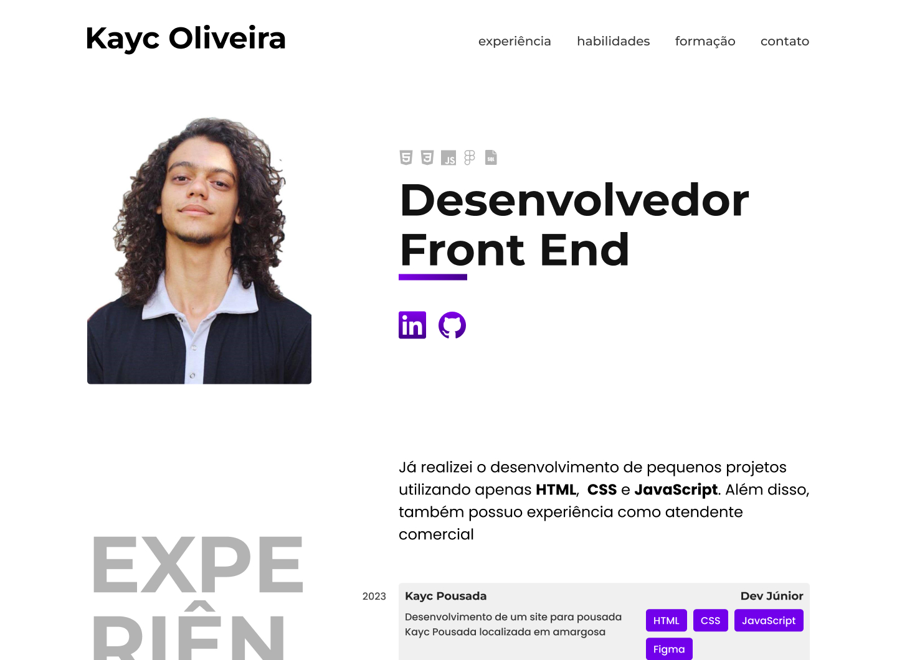

# Meu Currículo

O projeto foi desenvolvido com auxílio e acompanhamento do curso de **UX/UI para iniciantes** e **HTML e CSS para iniciantes** da **Origamid**

## 💻 Tecnologias
- HTML
- CSS
- JavaScript
- Figma

## 🔗 Links
- [Acesse o Projeto](https://kaycso.github.io/Curriculo/)